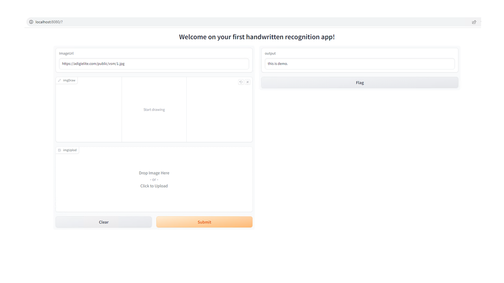
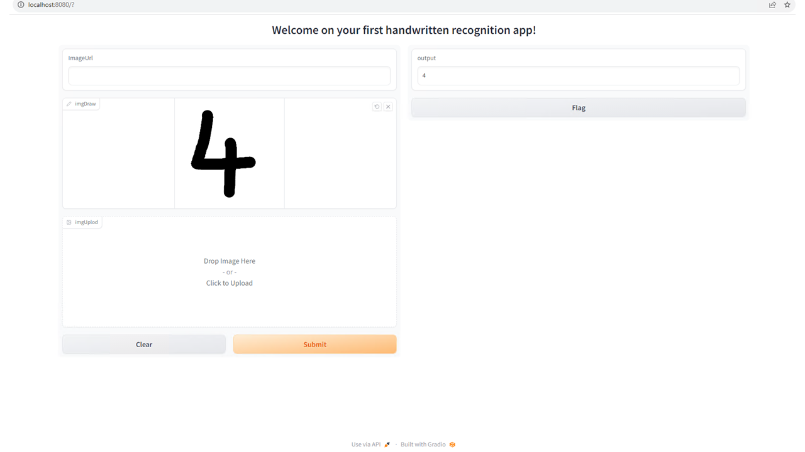
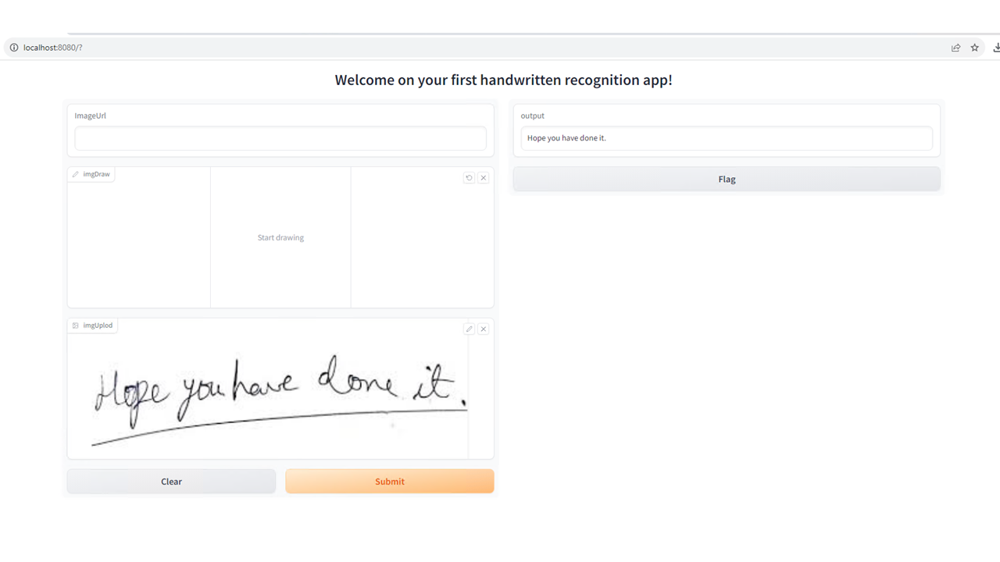

# Transform Handwritten Text into Digital Text with Hugging Face's Microsoft/Trocr-Large-Handwritten Model
Learn how to effortlessly convert handwritten text into editable digital text using the power of the Microsoft/Trocr-Large-Handwritten model from Hugging Face. With the help of Gradio, a user-friendly interface, you can streamline the process of extracting information from handwritten notes.

## Run
The provided set of commands is a series of instructions for creating a Python environment, activating it, installing dependencies, and running a Python script. Let me break down each step for you:

### Create enviornment 
``` 
conda create --name trocr-large python=3.11
```
This command creates a new Conda virtual environment named "trocr-large" with Python version 3.11. Virtual environments are isolated environments where you can install specific packages and dependencies without affecting your system-wide Python installation.

### Activate the virtual enviornment
```
conda activate trocr-large 
```
After creating the environment, you need to activate it. This ensures that any subsequent package installations or code executions occur within the isolated environment you just created.

### Install dependencies
```
conda install -c huggingface transformers
conda install pytorch torchvision torchaudio pytorch-cuda=11.7 -c pytorch -c nvidia
conda install -c conda-forge gradio
```
These commands install the necessary dependencies into the "trocr-large" environment:
- The first command installs the "transformers" package from the Hugging Face repository.
- The second command installs PyTorch, torchvision, and torchaudio, specifying CUDA version 11.7 for GPU support.
- The third command installs Gradio, a Python library for creating user interfaces for machine learning models.

### Run 
``` 
python handwritten.py
```
Finally, this command runs a Python script named "handwritten.py" within the "trocr-large" virtual environment. This script likely contains code that utilizes the installed packages and performs some functionality related to handwritten text processing, potentially using the Microsoft/Trocr-Large-Handwritten model.


## Code explanation
This code sets up a handwritten text recognition application using the Hugging Face Transformers library, Gradio for the user interface, and Microsoft's TrOCR model for handwritten text recognition. Let's break down the code step by step:

- Importing Libraries:
  The code starts by importing the necessary libraries:
    *transformers* for working with pre-trained models and tokenizers.
    *PIL* (Python Imaging Library) for image processing.
    *requests* for fetching images from URLs.
    *gradio* for creating a user interface for the application.
```
from transformers import TrOCRProcessor, VisionEncoderDecoderModel
from PIL import Image
import requests
import gradio as gr
```

- Defining the Title:
  The `title` variable contains the title for the Gradio application, which is displayed as "Welcome on your first handwritten recognition app!".
```
title = "Welcome on your first handwritten recognition app!"
```
- Loading the Model:
  The code loads the TrOCR model and processor from Hugging Face's model hub:
    *TrOCRProcessor* is used to preprocess images for the TrOCR model.
    *VisionEncoderDecoderModel* is the main TrOCR model for handwritten text recognition.
```
processor = TrOCRProcessor.from_pretrained('microsoft/trocr-large-handwritten')
model = VisionEncoderDecoderModel.from_pretrained('microsoft/trocr-large-handwritten')
```

- Prediction Function:
  The `predict` function is defined to perform handwritten text recognition:
    It takes three inputs: `ImageUrl` (URL of an image), `imgDraw` (handwritten image), and `imgUplod` (uploaded image).
    Depending on which input is provided, it fetches the image in RGB format.
    It preprocesses the image using the `processor` and generates text predictions using the `model`.
    The predicted text is returned.

```
  #predict the image using microsoft/trocr-large-handwritten model loaded earlier
  pixel_values = processor(images=image, return_tensors="pt").pixel_values
  generated_ids = model.generate(pixel_values)
  generated_text = processor.batch_decode(generated_ids, skip_special_tokens=True)[0]
  return generated_text
```

- Gradio Interface:
  The code sets up the Gradio interface:
    `gr.Interface is` used to create a user-friendly interface for the prediction function.
    The fn parameter specifies the prediction function (predict).
    *inputs* define the input components of the interface:
      `"text"` is a text input.
      `gr.Sketchpad` allows users to draw handwritten text.
      `gr.Image` lets users upload an image.
    *outputs* specifies that the output should be in text format.
    The title parameter displays the title defined earlier.
```
interface = gr.Interface(fn=predict, inputs=["text",gr.Sketchpad(type="pil",shape=(500, 500)),gr.Image(type="pil")], outputs="text", title=title )
```

- Launching the Interface:
  Finally, the interface is launched:
    `interface.launch` starts the Gradio interface on the server with the IP address "0.0.0.0" and port 8080.
```
interface.launch(server_name="0.0.0.0", server_port=8080)
```

In summary, this code creates a web-based handwritten text recognition application where users can input text, draw handwritten text, or upload an image containing handwritten text. The application then uses the Microsoft TrOCR model to recognize and display the text from these inputs in real-time through a user-friendly interface. 

## Handwritten to text from url


## Handwritten to text from canvas drawing


## Handwritten to text from image upload

